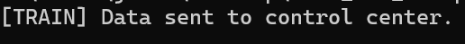
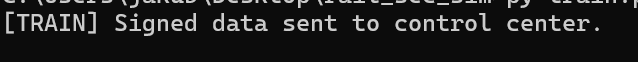
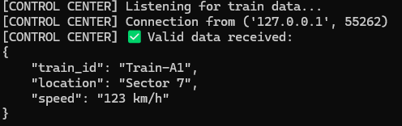
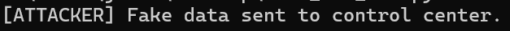
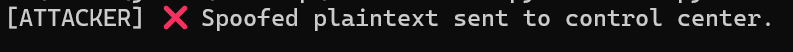
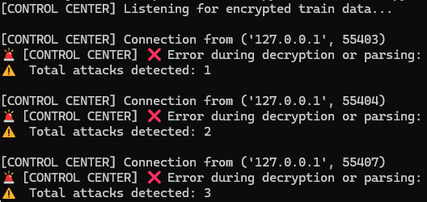
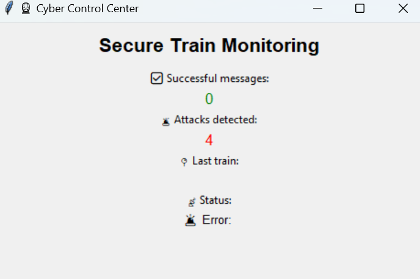

# rail_sec_sim
simulator of attacks and security in the train-control system

The system demonstrates how encrypted and signed messages can be sent from a train to a control center and how attacks such as message tampering or spoofing can be detected.
It focuses on basic concepts: encryption, integrity checks, spoofing detection, and basic secure protocols.

Trains send signed and encrypted messages (ID, location, speed) via sockets.

The control center decrypts and verifies each message.

A simulated attacker sends tampered or spoofed messages.

The system detects and logs successful messages and cyber attacks.

Includes a Tkinter dashboard for real-time monitoring (status, counters, last train).

